# Título do Projeto: Desenvolvimento de API de Cadastro para Pizzaria Basico

## Tecnologias Utilizadas:
- **Linguagem de Programação**: Java
- **Gerenciamento de Dependências**: Maven
- **Framework**: Spring Boot
- **Ambiente de Desenvolvimento**: Visual Studio Code
- **Teste de API**: Postman
- **Servidor de Implantação**: Apache Tomcat

## Objetivo do Projeto:
O objetivo deste projeto é criar uma API RESTful que permita o cadastro de informações de clientes de uma pizzaria, incluindo nome, telefone, endereço e data de nascimento. A API fornecerá endpoints para criar, recuperar, atualizar e excluir registros de clientes.

## Arquitetura do Projeto:

1. **Estrutura do Projeto**: O projeto Spring Boot é organizado seguindo as melhores práticas de estrutura de pacotes. As classes são distribuídas em pacotes como `controller`, `exception`, `repository`, e `model`.

2. **Maven para Gerenciamento de Dependências**: O Maven é usado para gerenciar todas as dependências do projeto. Isso inclui o Spring Boot Starter, o Spring Data JPA, o Spring Web, entre outros.

3. **Modelagem de Dados**: A classe `Cadastro` é criada como um modelo de dados com atributos como nome, telefone, endereço e data de nascimento. A anotação JPA é usada para mapear essa classe a uma tabela em um banco de dados.

4. **Camada de Repositório**: A camada de repositório (package `repository`) contém interfaces que estendem JpaRepository para realizar operações de CRUD no banco de dados e a Globais Exceptions. Isso permite a interação com o banco de dados de forma mais simples.

5. **Camada de Serviço**: A camada de serviço (package `model`) contém lógica de negócios relacionada a clientes, como validações e regras de negócios. Ela também faz uso da camada de repositório para acessar os dados no banco de dados.

6. **Controladores**: Os controladores (package `controller`) são responsáveis por definir os endpoints da API REST. Eles usam a camada de serviço para processar as solicitações HTTP, como criar um novo cliente, recuperar detalhes de clientes, atualizar informações e excluir registros.

7. **Teste Local com Postman**: Para testar a API localmente, a ferramenta Postman é utilizada. Os endpoints da API são testados para garantir que eles funcionem conforme o esperado.

8. **Implantação no Apache Tomcat**: Após o desenvolvimento e teste local, a aplicação é empacotada em um arquivo WAR (Web Application Archive) e implantada em um servidor Apache Tomcat para disponibilização pública.

## Benefícios:

- **Facilidade de Manutenção**: O uso do Spring Boot facilita a configuração e o desenvolvimento de aplicações web.
- **Estrutura Organizada**: O projeto segue uma estrutura bem organizada e modular.
- **Testes Eficientes**: O uso do Postman permite a validação rápida dos endpoints.
- **Implantação Simples**: O Apache Tomcat é uma escolha comum para implantação de aplicativos Java.

Em resumo, este projeto demonstra a criação de uma API de cadastro para uma pizzaria usando Java, Spring Boot e Maven, com foco na organização, testes e implantação eficientes. Essa solução permite que a pizzaria gerencie os dados dos clientes de forma simples e eficaz.

```mermaid
graph TD
  A[Cadastro Basico Dio 2023] --> B[API RESTful ]
  A --> C[Objetivo do Projeto]
  A --> D[Arquitetura do Projeto]
  D --> E[Estrutura do Projeto]
  D --> F[Maven para Gerenciamento de Dependências]
  D --> G[Modelagem de Dados]
  D --> H[Camada de Repositório]
  D --> I[Camada de Serviço]
  D --> J[Controladores]
  D --> K[Teste Local com Postman]
  D --> L[Implantação no Apache Tomcat]
  C --> M[Benefícios]

  B --> LinguagemJava[<b>Linguagem de Programação:</b> Java]
  B --> Maven[<b>Gerenciamento de Dependências:</b> Maven]
  B --> SpringBoot[<b>Framework:</b> Spring Boot]
  B --> AmbienteVSCode[<b>Ambiente de Desenvolvimento:</b> Visual Studio Code]
  B --> Postman[<b>Teste de API:</b> Postman]
  B --> Tomcat[<b>Servidor de Implantação:</b> Apache Tomcat]

  E --> Pacotes[Pacotes]
  Pacotes --> Controller[controller]
  Pacotes --> Exception[exception]
  Pacotes --> Repository[repository]
  Pacotes --> Model[model]

  G --> Cadastro[Cadastro]
  G --> JPA[JPA]

  H --> JpaRepository[JpaRepository]
  H --> GlobalExceptions[Globais Exceptions]

  I --> LógicaDeNegócios[Lógica de Negócios]

  J --> Endpoints[Endpoints da API]

  K --> PostmanTool[Postman]

  L --> ApacheTomcat[Apache Tomcat]

  M --> Maintenance[<b>Facilidade de Manutenção</b>]
  M --> Structure[<b>Estrutura Organizada</b>]
  M --> EfficientTesting[<b>Testes Eficientes</b>]
  M --> SimpleDeployment[<b>Implantação Simples</b]

```

